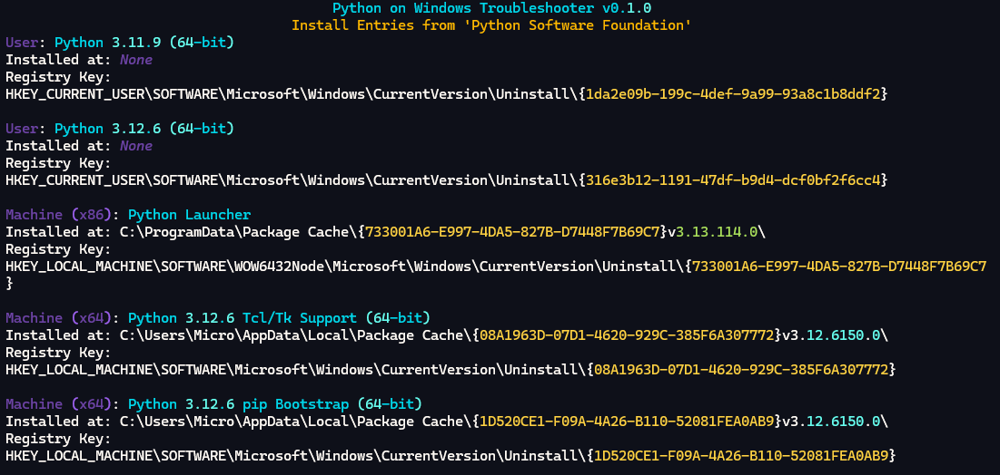

# Python on Windows Troubleshooter (pywintrbl)

<!-- markdownlint-disable MD033 -->


> [!warning]
> Because this project is currently **experimental**, it provides **no way** of removing these traces. You will have to do this **manually** (or alternatively with third-party removal tools).

This is a troubleshooting tool designed to look for traces of PythonCore (CPython/python.org) installations on Windows.

## Why?

It is common for users to reinstall or modify their existing Python installations. Unfortunately, uninstallers in general do a pretty subpar job at removing all traces of what they installed. This can cause problems when installing Python again or adding newer versions, leading to some of the following issues:

- The installer complains about a "newer version of Python" being installed.
- The installer "cancels" the installation with no apparent reason.
- The installer fails with a "fatal error" with a reason only decipherable by reading the logs.

## How do I use this?

> [!note]
> As this is very recent software and not frequently downloaded, Microsoft SmartScreen/Defender and similar reputation-based engines may flag this file. You may decide to ignore these warnings or instead use `pywintrbl` as a package as outlined below.

A precompiled binary for Windows is available for you to run in [Releases](https://github.com/aescarias/pywintrbl/releases). You will need to have the [Microsoft VC++ Redistributable](https://learn.microsoft.com/en-us/cpp/windows/latest-supported-vc-redist?view=msvc-170#latest-microsoft-visual-c-redistributable-version) installed to be able to run the troubleshooter.

If you have a working copy of Python available, you can also use this project as a package.

```sh
# clone the repository
git clone https://github.com/aescarias/pywintrbl
# install the package
py -m pip install -e .
# run it
py -m pywintrbl
```

## How does this work?

`pywintrbl` scans multiple common locations where Python and its install files are created. It also checks the Windows registry for signs of an installation on your device.

The locations scanned are:

- The PEP 514 registry at `HKLM\SOFTWARE\Python\PythonCore` (and its user equivalent at HKCU).
- The uninstall registry at `HKLM\SOFTWARE\Microsoft\Windows\CurrentVersion\Uninstall` (and its user equivalent at HKCU).
- The Microsoft store app registry at `%ProgramFiles\WindowsApps\` (access to this folder requires admin privileges).
- The PATH environment variable.

``pywintrbl`` creates an HTML log of the data within these locations. This allows users to diagnose issues relating to their Python installations.


